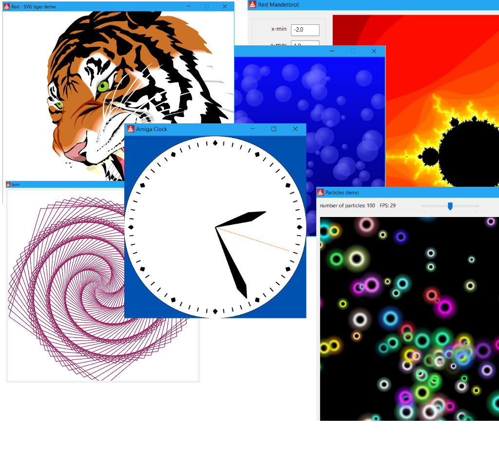
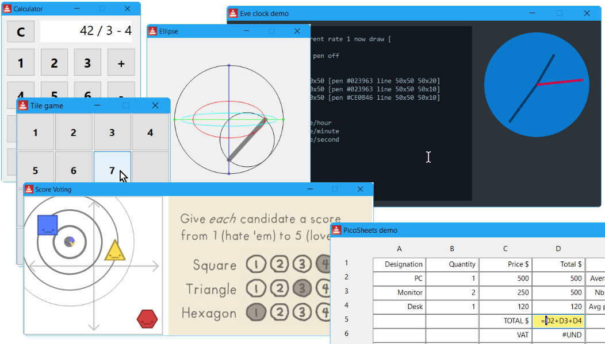

# Red/Code

This repository contains code written in Red and its dialects by the Red team and community. There are four sections in the repository, Apps, Scripts, ShowCase and Library. This repository is curated in the sense that contributions are included when they meet the applicable criteria of higher code quality, completeness and relevancy. For a place where to find general user scripts, see the [red/community](https://github.com/red/community) repository.

## Apps

Complete applications, any domain accepted (tools, games, demos,...).

## Scripts

This section of the repository contains short scripts which demonstrate both features of Red and its expressiveness. These scripts can be run from the Red console or require compilation in case of scripts including Red/System parts.

## Showcase

This is a collection of scripts or apps which show both the breadth and depth of Red and its wide applicability. Every one is complete with no external dependencies. 

## Library

This is a collection of useful Library functions and modules that can be included in Red programs. Its two sub-sections are Red and Red/System. All library functions and modules have API documentation. Bear in mind that modules support in Red is not yet there, so libraries are currently just simple scripts.

## Contributing

Quality contributions are always most welcome. If you would like to have an entry included in Red/Code, please read The (Red/Code Contributors' Guideline). Please provide also a proper Red header with at least the following fields: Title, Author, Date, Purpose, Rights (license name/URL for your code, by default it will be public domain). If applicable, also provide a short explanation of how to use your app/code in the header.

 
